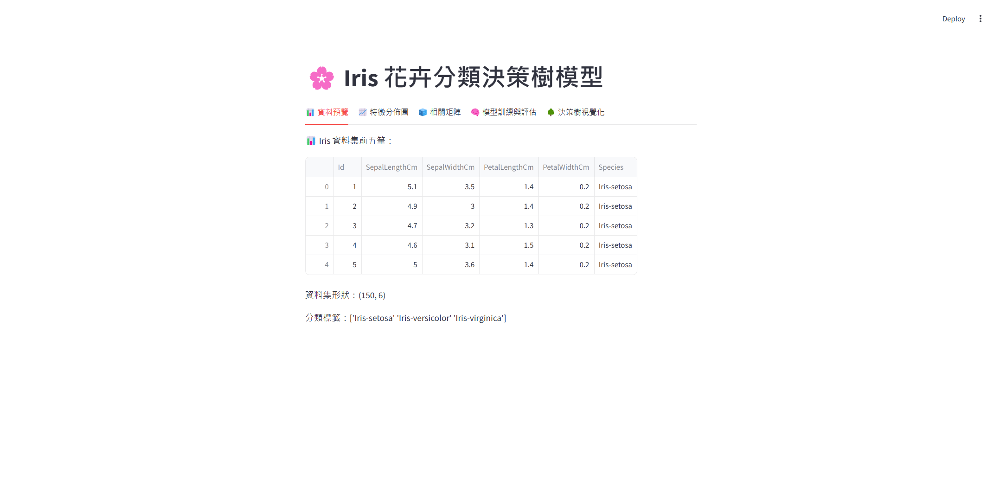
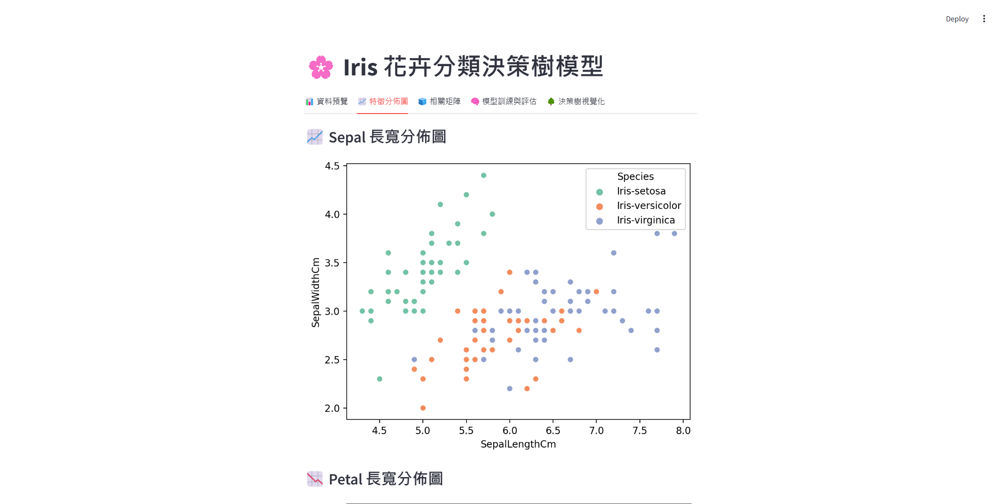
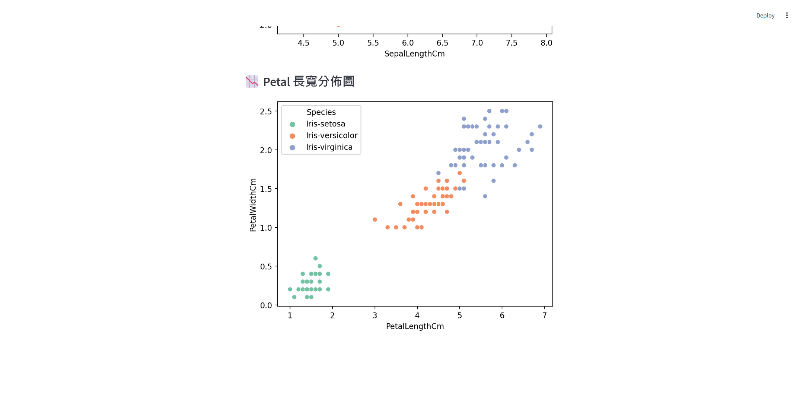
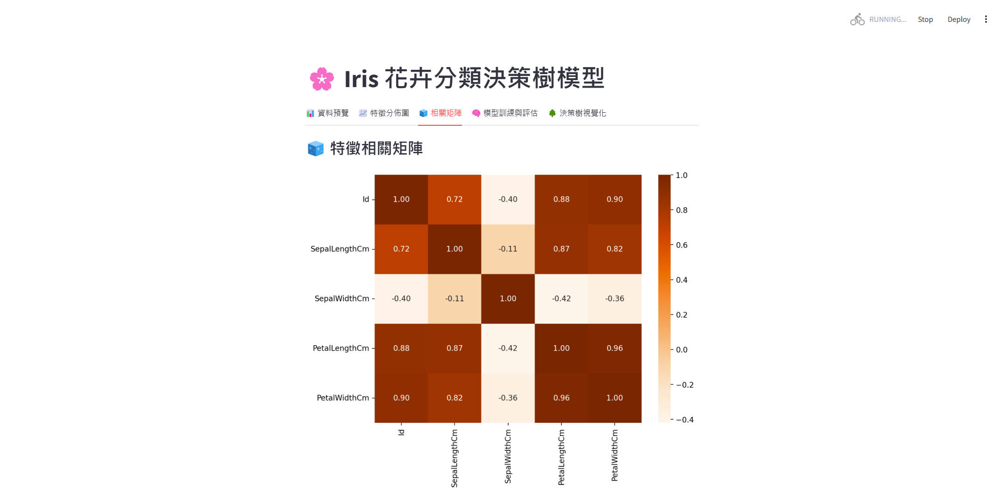
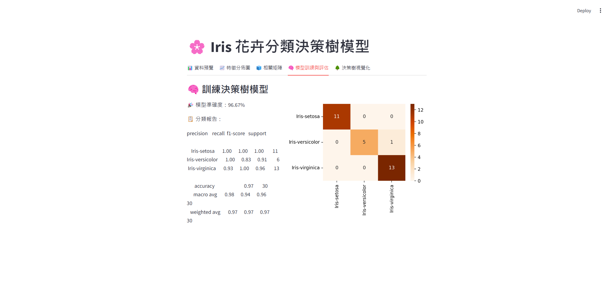
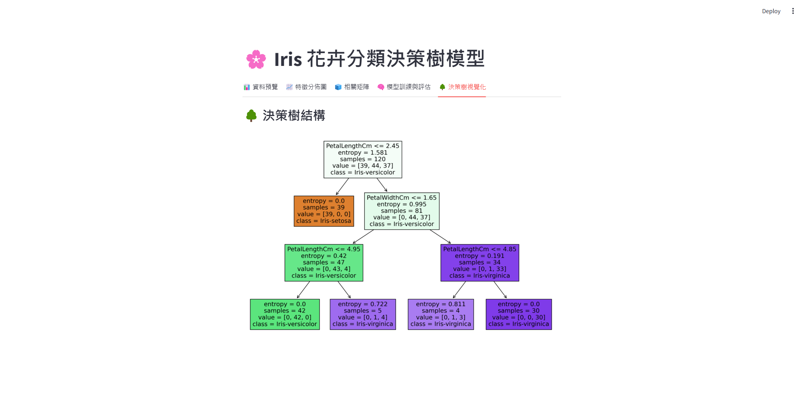

# Iris Classification Decision Tree

### DataSet From [Kaggle - Iris Species](https://www.kaggle.com/datasets/uciml/iris)

## Overview

- Language: Python v3.9.15
- Package: Scikit-Learn
- Model: Decision Tree
- Loss Function: Cross Entropy
- Max Depth: 5, Min Samples Leaf: 3

## Run

### Run code
```bash
python iris-classification-decision-tree.py
```


### Run streamlit

```bash
streamlit run iris-classification-decision-tree-app.py
```

server running at `http://localhost:8501`

## Data



## Data Distribution





## Correlation Matrix



## Confusion Matrix - Accuracy Rate 96.67%




## Tree Plot




